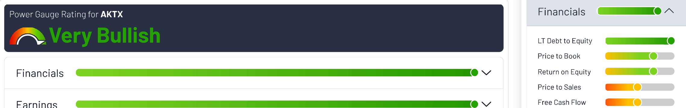
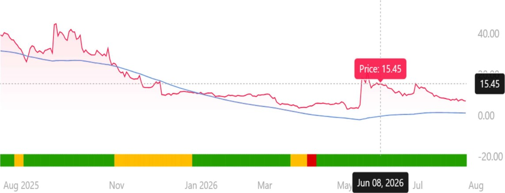
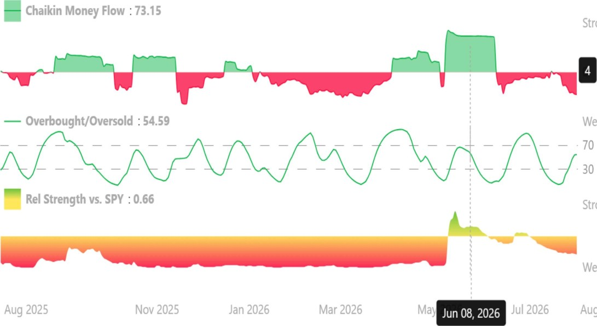

# CHAIKINANALYTICS

Akari Therapeutics, Plc (AKTX)

Biotechnology: Strong QI Reported: Beat By \$2.80 Report Generated: August 14, 2026

\$7.50 +0.50 (7.1%)

| Earnings |
|---------------------------------------------------------|

08/14/26 03:32PM EDT

Technicals

Experts 

Power Gauge Summary

The Chaikin Power Gauge RatingTM for AKTX is Very Bullish due to very attractive financial metrics, very strong earnings performance and positive expert activity. The stock also has very weak price/volume activity.

AKT)Cs financial metrics are excellent due to a low long term debt to equity ratio. AKTX's earnings performance is very strong as a result of high earnings growth over the past 3-5 years.

Power Gauge Rating as of 08/14/2026

| AKTX U -82.2% |  |
|---------------|-------------------------------------------------|

Strong

Strong

Aug 2026

Articles/ Reports Mentioning AKTX

info@ChaikinAnal tics.com

Power Gauge Summary

The Chaikin Power Gauge RatingTM for AKTX is Very Bullish due to very attractive financial metrics, very strong earnings performance and positive expert activity. The stock also has very weak price/volume activity.

AKTX's financial metrics are excellent due to a low long term debt to equity ratio. AKTX's earnings performance is very strong as a result of high earnings growth over the past 3-5 years.

Power Gauge Rating as of 08/14/2026

Company Profile

Akari Therapeutics, Plc, an oncology company, develops antibody-drug conjugates (ADC) for cancer-killing toxins. Its lead payload is PHI to disrupt the function of spliceosomes and to trigger an immune response that leads to additional cancer cell killing.

Employees: 6

Industry: Biotechnology

Sector: Health Care

Address: 401 East Jackson Street,

Suite 3300, Tampa, FL, USA

410 current articles

# CHAIKINANALYTICS

Quick Stats

Fundamentals

Market Cap \$8.00 M

\$0.00

Proj 1 year P/E N/A

Yield N/A

Performance

52 Week High/Low 49.60/3.02

52 Week Performance -82.2%

Rel Strength to SPY -102.8%

Beta 1.41

Ratios

LT Debt-Equity 0.00

Price-Book 0.56

IY ROE -123.3%

Price-Sales N/A Technicals

21-Day Exp Moving Avg\*

Long Term Trend Line\*

Chaikin Money Flow\*

Technical Trend

\*as of Aug 13, 2026

Earnings

EPS (prev FY)

EPS ('26)

Annual 5Y EPS Growth

Analyst Revisions

Fiscal year end month is December

Dividends

Annual Dividend (FWD)

Payout

Ex Dividend Date

Annual 5Y Growth Rate Report Generated: August 14, 2026

8.53

1.12

\-45.13 (Weak)

Strong

N/A

\$-12.oo

N/A

0.0%

N/A

N/A

N/A

CHAIKINANALYTICS Report Generated: August 14, 2026

Disclaimer: This report describes the position of Chaikin Power Gauge factors relative to the Russell 3000 universe or the stock's Industry Group, depending on the factor. Chaikin Analytics (CA) is not registered as a securities broker dealer or investment advisor with either the U.S. Securities and Exchange Commission or with any state securities regulatory authority. CA is not responsible for trades executed by users of this research report, our web site or mobile app based on the information included herein. The information presented in this report does not represent a recommendation to buy or sell stocks or any financial instrument nor is it intended as an endorsement of any security or investment. The information in this report is generic by nature and is not personalized to the specific financial situation of any individual. The user bears complete responsibility for their own investment research and should seek the advice of a qualified investment professional before making any investment decisions.

Financial Market Data powered by Quotemedia.com. All rights reserved. View the Terms of Use. NYSE/NYSE MKT (AMEX) data delayed 20 minutes. NASDAQ and other data delayed 15 mins unless indicated.

CopyrightO 2026, S&P Global Market Intelligence (and its affiliates as applicable). Reproduction of any information, opinions, views, data or material, including ratings ("Content") in any form is prohibited except with the prior written permission of the relevant party. Such party, its affiliates and suppliers ("Content Providers") do not guarantee the accuracy, adequacy, completeness, timeliness or availability of any Content and are not responsible for any errors or omissions (negligent or otherwise), regardless of the cause, or for the results obtained from the use of such Content. In no event shall Content Providers be liable for any damages, costs, expenses, legal fees, or losses (including lost income or lost profit and opportunity costs) in connection with any use of the Content. A reference to a particular investment or security, a rating or any observation concerning an investment that is part of the Content is not a recommendation to buy, sell or hold such investment or security, does not address the suitability of an investment or security and should not be relied on as investment advice. Credit ratings are statements of opinions and are not statements of fact.

This report from Chaikin Analytics is for informational purposes only and is not a recommendation to buy or sell securities.

