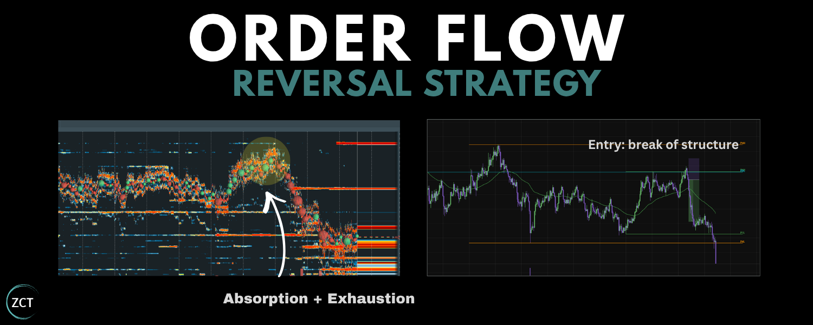

**My Orderflow Reversal Strategy**

Every trader has bought a dip that just kept dipping.

I've traded for 9 years, and orderflow is how I stopped being on the wrong side of it. Here’s exactly how I do it.

**What you’re going to get in this Article ↓**

-   **Lesson 1:** Strategy, Order Flow and Bookmap Essentials
-   **Lesson 2:** My Ideal Conditions for Order Flow Reversals
-   **Lesson 3:** Live Trade Examples + 3 Bonus Resources

🧠 **Note to reader:** this one's detailed. Read it properly, and you'll walk away knowing more than the traders on the other side of your next trade.

**Lesson 1: Strategy, Order Flow and Bookmap Essentials**

First, the part nobody wants to admit:

**Your strategy probably isn't the problem. Your conditions are.**

I’d bet you've already got a folder full of strategies… **(saved threads, a half-finished course, three indicators you stopped trusting.)**

What you're missing is a way to see whether the trade in front of you is **actually** there.

Because you can read the setup perfectly, pull the trigger at the level, size it like a sniper and **still** hand the money back, because the candles misled you.

-   Picture price ripping into a level.
-   The chart screams breakout.
-   The timeline screams “*send it”*.
-   Every trader is loading longs.

But you? You're clicking **sell.**

-   The level holds.
-   Price tumbles back.
-   The longs get unwound, **one by one, into your TP.**

Nothing on the candles told you that was coming. **Order flow did.**

-   Bids stepping back.
-   Aggressive buyers exhausted.
-   The breakout was already running on fumes.

**There's no secret indicator here. There rarely is. It's just reading who's actually in the trade, and who's about to be wrong.**

**Let's dive into the lesson ↓**

**This lesson will cover:**

-   Reversal Trading as the ‘Opposite’ of Breakout Trading
-   Order Flow Basics (60 Second Recap)
-   Bookmap (my preferred tool to read order flow)

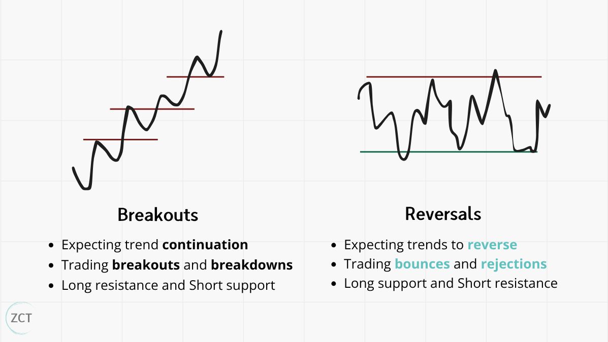**Reversal Trading as the ‘Opposite’ of Breakout Trading**

**The fastest way to understand reversal trading is to hold it up against its mirror image.**

-   **A breakout trader expects the trend to continue.** They trade breakouts and breakdowns: buying as price clears resistance, selling as it slices through support.
-   **A reversal trader expects the opposite**. They trade bounces and rejections: longing support, shorting resistance, betting the move runs out of road.

💡 **Insight 1:** When you trade a reversal, a trapped breakout crowd is your counterparty. Hold

onto that: it's the whole engine, and it's why the trade pays.

**You can use order flow for both strategies.**

I already wrote a masterclass on order flow for breakouts (linked at the end of the article).

**Enough of you asked for the other half that I put this together: how I read order flow to trade reversals.**

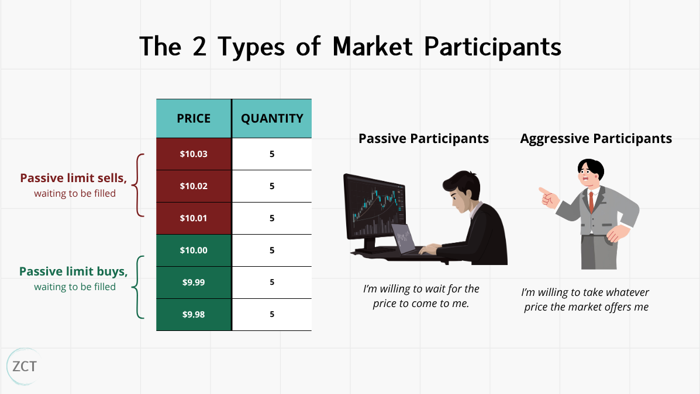**Order Flow Basics (60 Second Recap)**

If you're new to this, here's the whole idea in 60 seconds. Price doesn't move by magic.

It moves when two kinds of traders collide.

-   **Aggressive traders use market orders** -\> *“I want in right now, at whatever price the market gives me*.”
-   **Passive traders use limit orders** -\> *“I'll wait, and I'll only trade at my price*.”

**You watch that collision on the order book:** the live ladder of limit orders waiting to be filled at each price.

**Order flow is then just the study of how price moves through that book**:

-   Who's pushing?
-   Who's waiting?
-   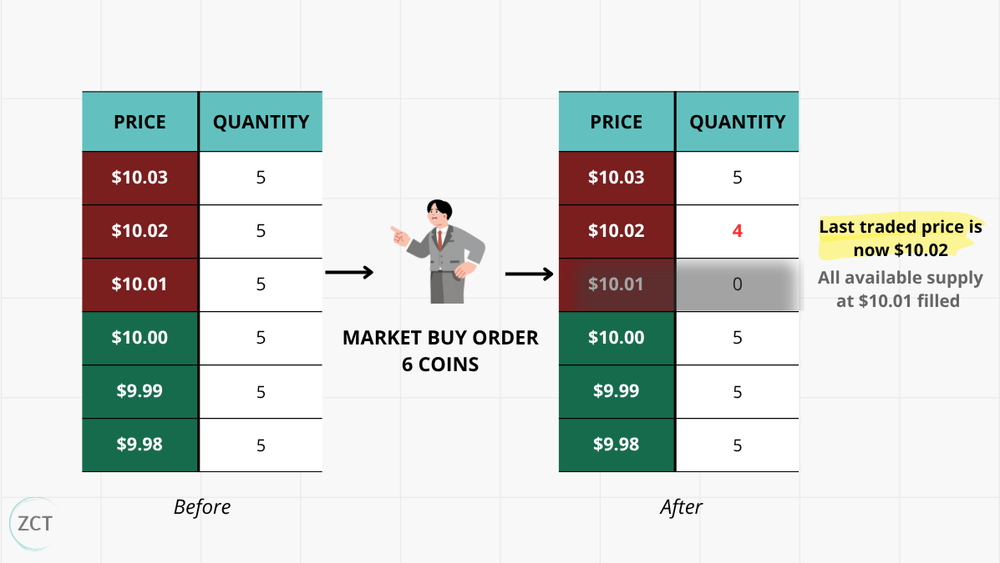Who runs out first?

🧠 **Note to reader:** this was a 60 second speed run. if you want a full masterclass on order flow mechanics, check out the bonus resources at the end.

**Bookmap (my preferred tool to read order flow)**

To see order flow visually on my screen, my preferred tool is Bookmap.

It brings the order book to life via a picture.

This picture shows 3 things at once:

1.  **Heat map**: passive limit orders resting in the book. Thick, bright lines are big orders. Faded, thin lines are next to nothing.
2.  **Volume bubbles**: aggressive market orders hitting the book. Bigger bubble, more size.
3.  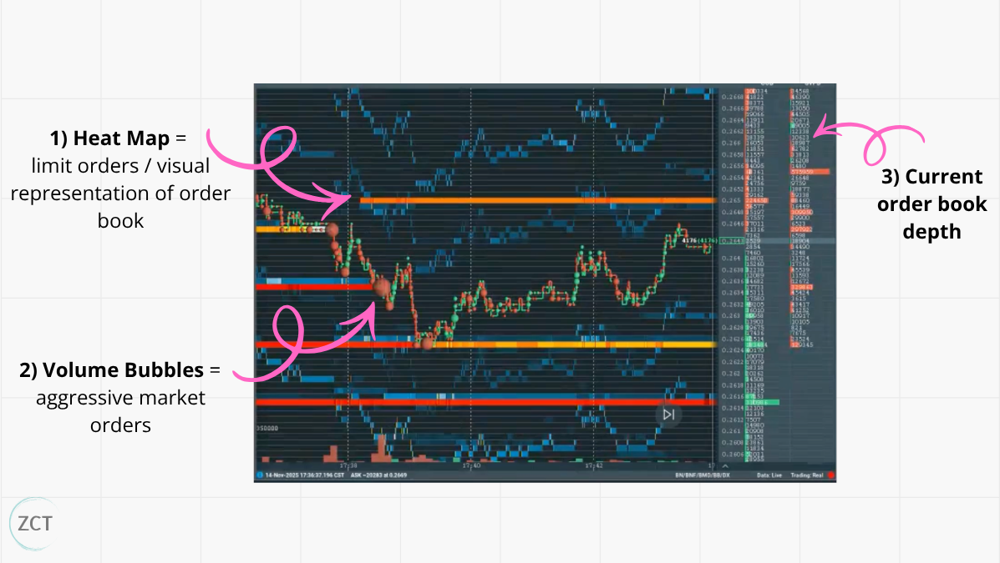**Live order book**: the ladder on the right-hand panel.

**Feeling overwhelmed?** I understand. It looks like a lot of machinery.

**When we go into the live trade examples, it will make a lot more sense.**

You’ll see that everything collapses into one question: who's trapped, and which way do they have to run?

**Once you're reading for that, the rest is detail.**

**Setup takes a few minutes:** sign up (use the Crypto Bundle), connect the Binance Futures feed where most of the volume lives, and pull up a liquid asset until you can see bubbles and heat.

✍ **TIP 1:** If you get confused during setup, Bookmap has a learning centre with video tutorials.

**BONUS: Watch The System**

This article gives the full written playbook.

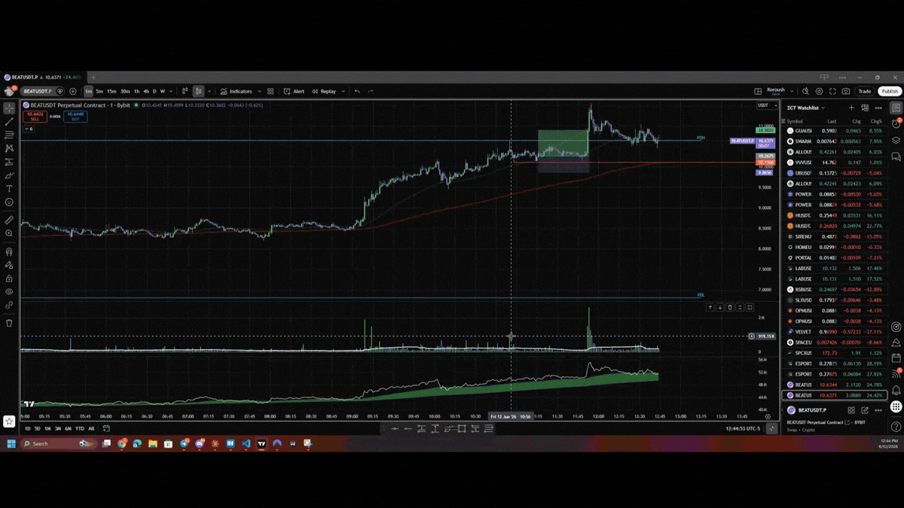**Some of you may want to see it in action.**

**My team recorded a video where they run the playbook from scratch:**

-   Reversal trade using Bookmap
-   Absorption and exhaustion playing out on the charts

[👉 **Click here to watch**](https://go.koroushak.io/orderflow-reversals)

**Summary: "Lesson 1: Strategy, Order Flow and Bookmap Essentials"**

**Reversal traders are basically the polar opposite of breakout traders.** They trade bounces and rejections: longing support, shorting resistance, betting the move runs out of road.

**As for order flow, the key idea is that price doesn't move by magic.** There is a live ladder of limit orders waiting to be filled at each price, by aggressive traders using market orders.

**To visualise order flow on my charts, I like to use Bookmap. It shows:**

-   A heat map of passive limit orders resting in the book
-   Volume bubbles to show aggressive market orders hitting the book, and
-   A live order book.

**Lesson 2: My Ideal Conditions for Order Flow Reversals**

**I use four variables to grade an order flow reversal.**

-   **When all four line up,** you've got an A+ reversal: full conviction, full size, an easy hold.
-   **When one is soft or missing, you usually don't walk away:** you size down, tighten your invalidation, and trade it as the lower-grade setup it is. (The one exception is the level itself, which has to be real; more on that in a second.)

(Treat them as conditions you read objectively, not vibes. A read you can repeat into a thousand trades and review afterwards. A vibe you can't.)

**Here's what I'm looking for, in order, and how much each one moves the needle.**

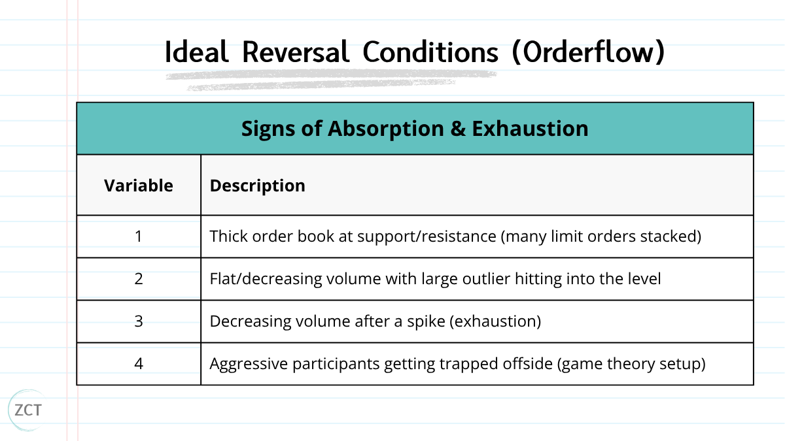

**This lesson will cover each variable:**

1.  The level has to actually exist
2.  Absorption (the wall that won't move)
3.  Exhaustion (the crowd runs out of breath)
4.  The trap (and why it pays you)

    **1. The level has to actually exist**

**You drew a horizontal line at a swing low and called it support.** Fine.

**But a line on your chart is not liquidity.**

If no limit orders are sitting there, there's nothing to bounce off, and your "support" breaks the second price arrives.

**This is where most reversal trades die before they start.**

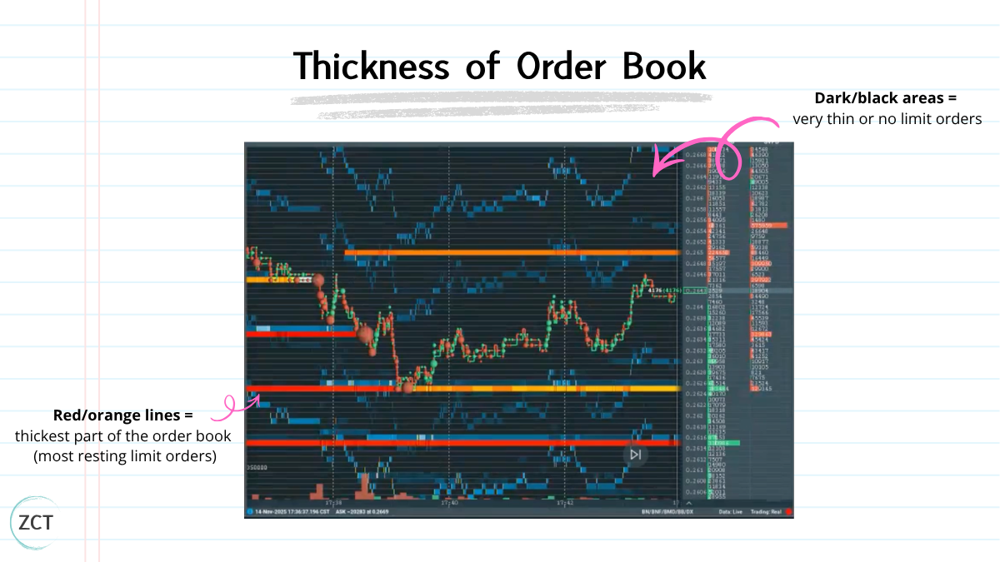Bookmap shows you the truth:

-   **Thick line + bright colour (orange/red/yellow)** = real orders stacked, real liquidity, a level that can actually hold.
-   **Thin line + faded colour (blue/dark)** = a ghost. It looks like a level on your chart, but there's no one home.

✍ **TIP 2:** No thick book at your level as price approaches? Then there's no trade, full stop. Of the four conditions, this is the one I never bend on: without a real level, there's nothing to

reverse off.

**2. Absorption (the wall that won't move)**

This is the heart of it: **large volume, no price movement.**

-   Picture price at \$10.05 with a thick red line (limit sells) sitting at \$10.10.
-   Big green bubbles start hammering \$10.10 → aggressive buyers paying up to get through.

    ● And price… doesn't go anywhere.

-   It stalls at \$10.10, maybe ticks back to \$10.09.

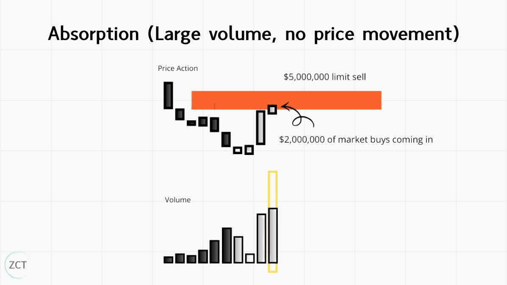**What's happening underneath**:

-   The limit sellers are taking the other side of every market buy.
-   The buyers are getting filled long.
-   The sellers are getting filled short.
-   But there are so many limit sells stacked there that all that buying pressure gets eaten without moving price.

**On the heat map, you'll see the line shift from red toward yellow as some liquidity gets taken, but the line stays. The wall is holding.**

That's absorption. Note it. But do **not** trade it yet.

Absorption alone isn't a reversal → it might just mean the buyers haven't bought enough yet. You need one more thing.

**3. Exhaustion (the crowd runs out of breath)**

**After the spike of aggression, watch the bubbles shrink.**

-   The green bubbles get smaller.
-   Less frequent.
-   The buyers threw everything at the wall, the wall held, and now they're spent.

💡 **Insight 2:** Absorption tells you the wall is real; exhaustion tells you the attackers are done. Both together is the A+. Absorption on its own means you're early; you can take it

small, but the clean read waits for the crowd to tire.

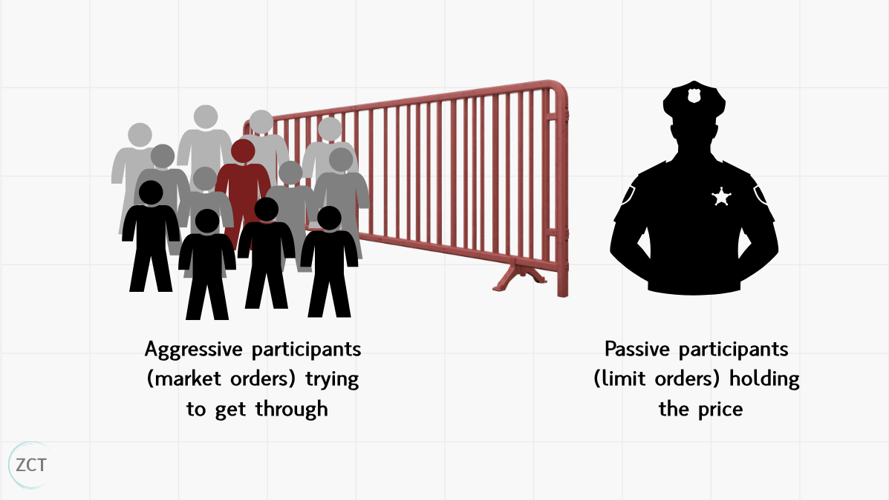**If the mechanics aren't sticking, use this picture.**

**A reversal level is a doorway with a wall of security guards in front of it.**

-   The aggressive buyers are a crowd trying to shove through.
-   **A hundred people push hard.**
-   The guards don't budge.

-   The crowd tires, and the people at the front, the ones who pushed hardest, are now crushed against the door, exhausted, with nowhere to go but back.

**Bookmap lets you watch all three at once:**

-   The crowd pushing (green bubbles)
-   The wall holding (thick lines)
-   The crowd tiring (shrinking volume).

**When you see the front row start to retreat, you already know which way the pressure releases.**

**4. The trap (and why it pays you)**

**This is the part that makes order flow genuinely powerful for reversals.**

**When aggression hits a thick level, and price doesn't move, you've created a clean game-theory setup.**

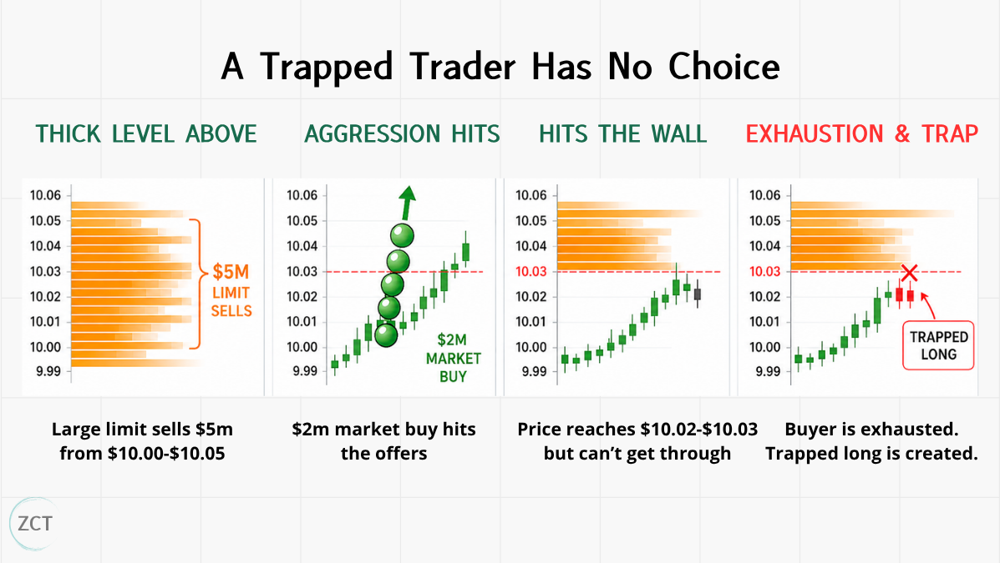

Say there's \$5 million limit sells from \$10.00-\$10.05. A big volume outlier (\$2 million market buy) comes in, and the price moves to \$10.02 but hits the wall at \$10.03 (the remaining \$3 million of limit sells). Now:

\- **The buyer just exhausted himself.** Using all his capital to enter, creating a quick spike

up and thin book below (meaning price can move lower easily).

\- **The seller is short \$2M and on side right away**. Price didn't move against them, and

they still have a thick book above. They're comfortable.

\- **The buyer is long \$2M and off-side**. They bought, and nothing happened. No more

buyers are following through. They're sweating.

**That trapped long is in a compulsory position.** They *have* to get out eventually: at breakeven, at a stop, or in a panic. And when they get out, they're selling.

💡 **Insight 3:** A trapped trader has no choice: they have to exit eventually. That forced exit is your fuel.

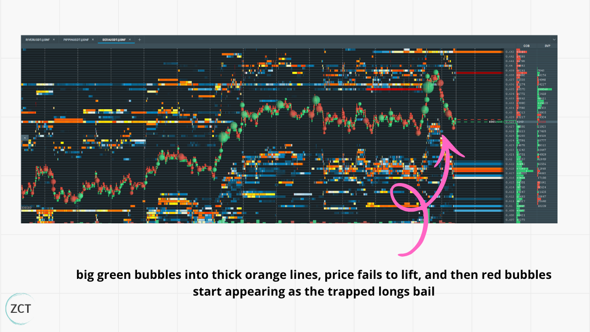**On Bookmap, you watch it happen in real time:**

-   Big green bubbles into thick orange lines
-   Price fails to lift.
-   Then red bubbles start appearing as the trapped longs bail.

-   That's the reversal igniting.

**When all four line up → real level, absorption, exhaustion, trapped participants → that's your A+: the highest-probability reversal conditions you'll get.**

**Summary: "Lesson 2: My Ideal Conditions for Order Flow Reversals"**

The four conditions, in order:

1.  **A real level**: a thick book of limit orders actually sitting there.
2.  **Absorption**: heavy buying that can't move price.
3.  **Exhaustion**: that buying drying up.
4.  **The trap**: aggressive buyers stuck offside, forced to sell their way out.

All four lining up is your A+, the highest-probability conditions you'll get, and where you size up. Fewer than four (as long as the level is real) is still tradeable, just smaller, and managed tighter.

**Lesson 3: Live Trade Examples + 3 Bonus Resources**

In this lesson we’re going to cover:

-   Live Trade Example and Explanation
-   3 Bonus Resources on Order Flow Reversal-related concepts

**Context: I've got 180 traders who've reached consistent profitability on these systems. Not one lucky run, but a real, repeatable edge over hundreds of trades.**

**Disclaimer: This won't win every time; nothing does. The edge isn't a perfect read; it's a repeatable one, with losses small enough that the maths works over hundreds of trades.**

Now that is out the way, let’s walk through some live trade examples.

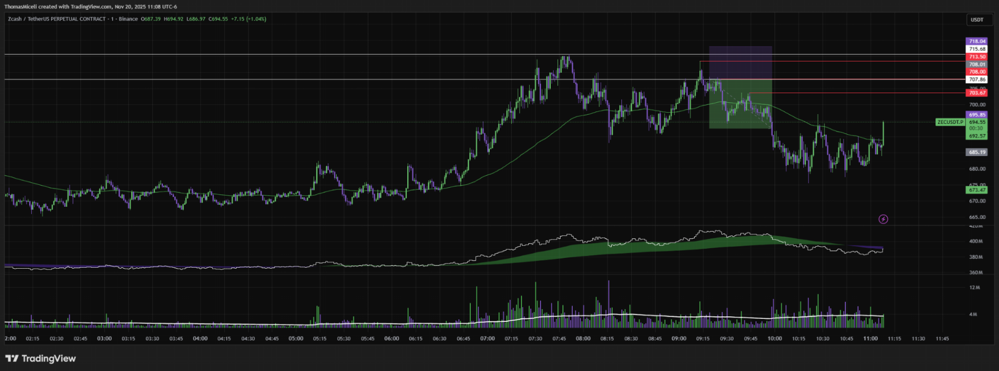**Real Trade Example 1**

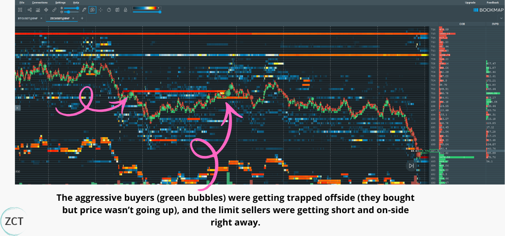

**What Bookmap showed:**

1.  **Market buyers** losing steam, trying to get back to previous highs.
2.  **Price failed to move higher**, Despite the aggressive buying (green bubbles) coming in

    for a renewed effort; price wasn’t breaking through resistance.

3.  **Continuous absorption**, The thick orange/red lines (limit sell orders) at resistance

    weren’t disappearing either; they were absorbing the buying until buyers weakened and the green bubbles began shrinking.

At resistance, this kind of buyer absorption is a clear bearish signal. The aggressive buyers were getting trapped offside (they bought but price wasn’t going up), and the limit sellers were getting short and on-side right away.

The chart validated this as well, with the short trade going on-side right away with volume decreasing.

**Real Trade Example 2:**

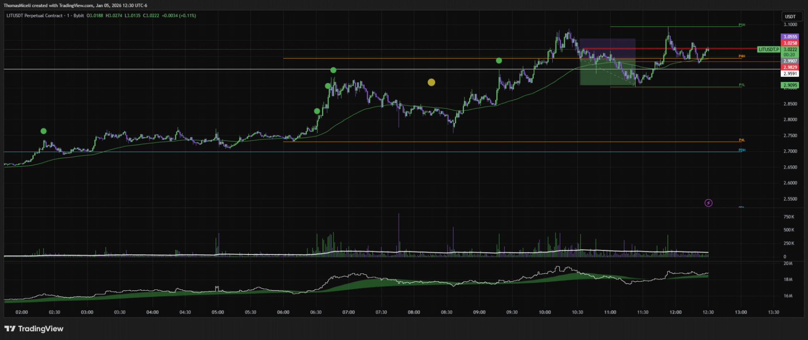

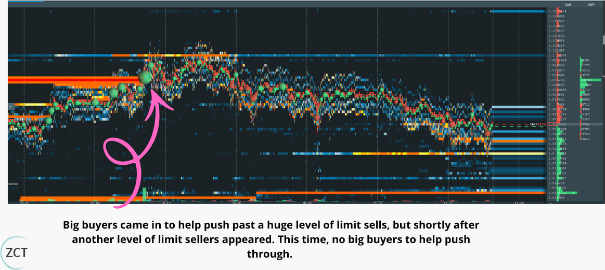

**What Bookmap showed:**

1.  **Market buyers pushing higher,** Lots of green bubbles (aggressive market buying) at the resistance level, showing strong buying pressure.
2.  **One big buyer** came in to help push past a huge level of limit sells, but shortly after another level of limit sellers appeared. This time, no big buyers to help push through.
3.  **Limit sellers** absorbed any buys that came in, and it didn’t take long for that big buyer to be pushed offside and into drawdown.

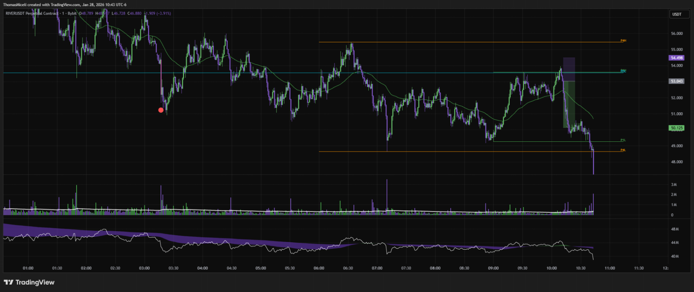**Real Trade Example 3:**

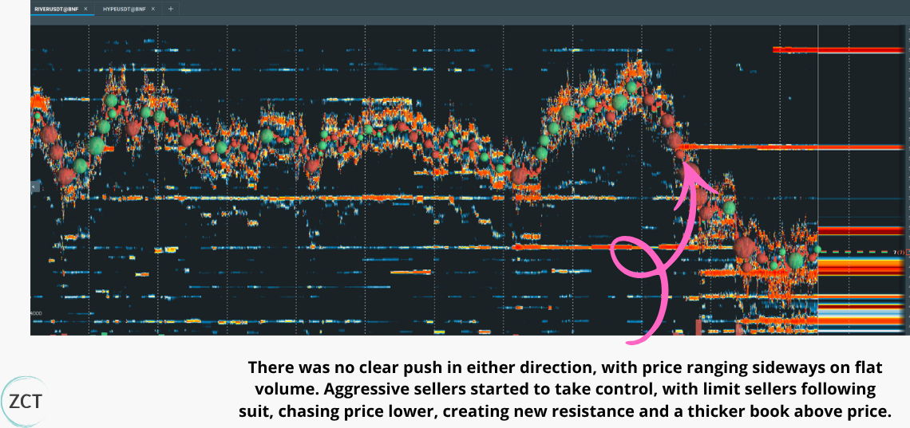

**What Bookmap showed:**

1\. **Neutral market volume;** there was no clear push in either direction, with price ranging sideways on flat volume (no aggressive participant in control) and a thin order book

1.  **Aggressive sellers** started to take control, with limit sellers following suit, chasing price lower, creating new resistance and a thicker book above price.
2.  **Market buyers,** who bought the range highs, FOMOing out of their positions, creating a massive sell-off into a thin book below.

**The Bottom Line**

Breakout traders are trading with the crowd while the path is clear.

Reversal traders go against the crowd at the exact moment they're most convinced they're right, and getting paid when they're forced to admit they're wrong.

**The chart won’t always show you that moment. The order flow will.**

**3 Bonus Resources**

Want to go deeper?

Here's where to take this next ↓

1.  **Order Flow Masterclass**

[**https://x.com/KoroushAK/status/2021579120077840700**](https://x.com/KoroushAK/status/2021579120077840700)

**The breakout side.** The other half of this: the same order flow read applied to breakouts instead of reversals. Same lens, opposite trade.

2.  **Support and Resistance Masterclass**

[**https://x.com/KoroushAK/status/2008873821626122750**](https://x.com/KoroushAK/status/2008873821626122750)

We speak a lot about levels in this article. Check out my exact formula to draw levels consistently (includes a custom indicator).

3.  **My Reversal Trading Strategy**

[**https://x.com/KoroushAK/status/2031718081945358497**](https://x.com/KoroushAK/status/2031718081945358497)

Dive deeper into reversal trading. Checklists for optimal trade environments, drawing levels and identifying setups, stop loss and take profit logic, etc.

**Summary: "Lesson 3: Live Trade Examples + 3 Bonus Resources"**

Across the three live trades, the same read repeated:

**Aggressive buyers leaned into a real level, the limit sell wall absorbed them, and once the buying dried up, the trapped longs were forced to sell their way out, the reversal's fuel.**

Grade the setup, don't gate it: four conditions is your A+ at full size; three with the level intact is still a trade, just smaller and tighter. The only flat no's are no real level, or a level that vanishes with no volume hitting it.

**Article Summary**

**Lesson 1: Strategy, Order Flow and Bookmap Essentials**

Reversal traders are basically the polar opposite of breakout traders. They trade bounces and rejections: longing support, shorting resistance, betting the move runs out of road.

As for order flow, the key idea is that price doesn't move by magic. There is a live ladder of limit orders waiting to be filled at each price, by either aggressive traders using market orders or passive traders using limit orders.

To visualise order flow on my charts, I like to use Bookmap. It shows:

-   A heat map of passive limit orders resting in the book
-   Volume bubbles to show aggressive market orders hitting the book, and
-   A live order book.

**Lesson 2: My Ideal Conditions for Order Flow Reversals**

The four conditions, in order:

1.  **A real level**: a thick book of limit orders actually sitting there.
2.  **Absorption**: heavy buying that can't move price.
3.  **Exhaustion**: that buying drying up.

    4\. **The trap**: aggressive buyers stuck offside, forced to sell their way out.

All four lining up is your A+, the highest-probability conditions you'll get, and where you size up. Fewer than four (as long as the level is real) is still tradeable, just smaller, and managed tighter.

**Lesson 3: Live Trade Examples + 3 Bonus Resources**

Across the three live trades, the same read repeated:

**Aggressive buyers leaned into a real level, the limit sell wall absorbed them, and once the buying dried up, the trapped longs were forced to sell their way out, the reversal's fuel.**

**Grade the setup, don't gate it: four conditions is your A+ at full size; three with the level intact is still a trade, just smaller and tighter. The only flat no's are no real level, or a level that vanishes with no volume hitting it.**

**P.S. I release masterclasses just like this every week for traders who are serious about reliably making money with trading. If that sounds like you, drop a follow to stay in the loop**

